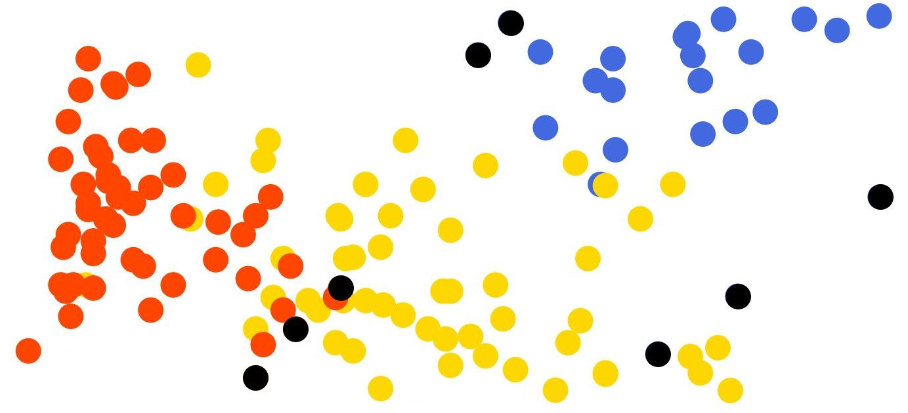
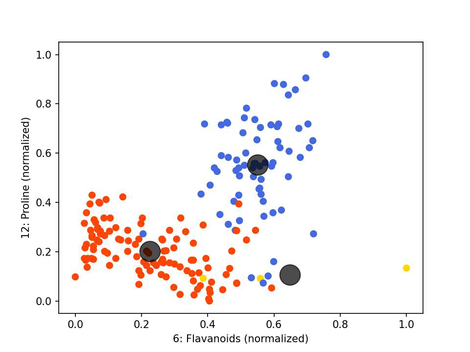
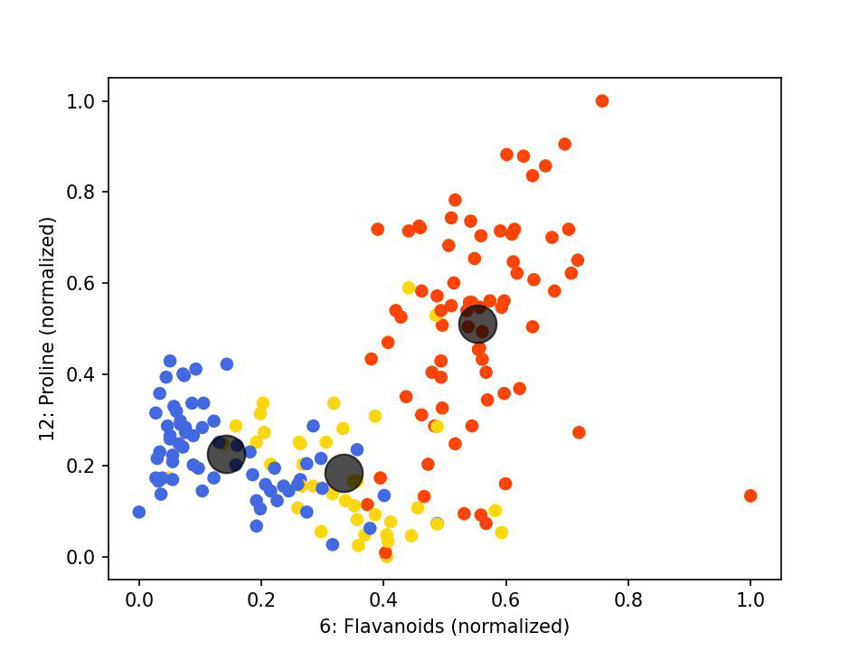
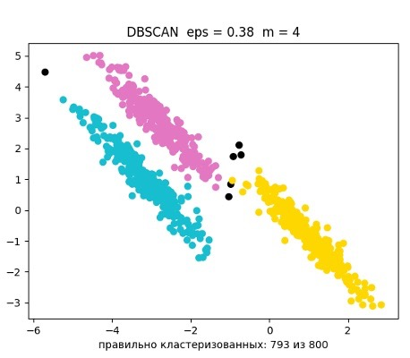
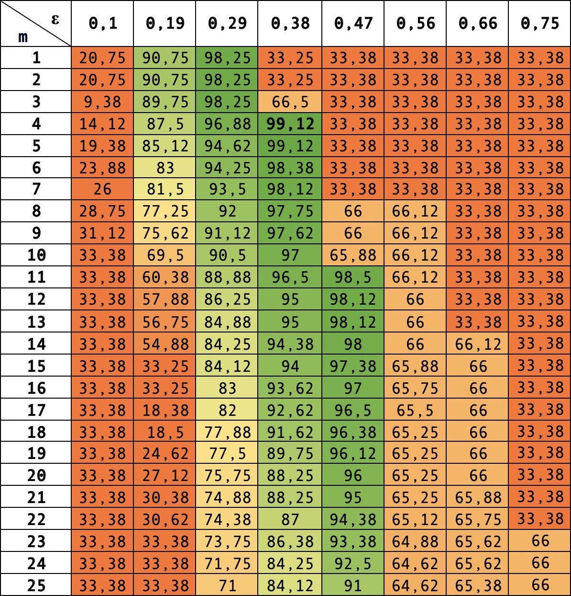

# Кластеризация с использованием алгоритмов K-Means и DBSCAN

## 🍇 K-Means 🍇
### 🍷 Теоретическое описание алгоритма
**K-Means** – это один из наиболее популярных алгоритмов кластеризации. Он предназначен для разбиения выборки на k кластеров таким образом, чтобы объекты внутри каждого кластера были максимально схожи между собой, а объекты из разных кластеров существенно отличались.

Алгоритм работает следующим образом:
1. Выбирается количество кластеров **k**.
2. Случайным образом выбираются **k** начальных центроидов.
3. Для каждого объекта определяется ближайший центр кластера, и объекту присваивается соответствующая метка.
4. Пересчитываются центроиды как среднее арифметическое всех объектов, отнесенных к кластеру.
5. Шаги 3-4 повторяются до тех пор, пока центроиды не перестанут изменяться или не будет достигнуто максимальное число итераций.

Оценка качества кластеризации производится путем сравнения меток, полученных алгоритмом, с истинными метками, если таковые имеются. Точность определяется как отношение числа правильно классифицированных объектов к общему числу объектов.

### 🍷 Данные эксперимента
В качестве тестового набора данных был выбран **Wine Data Set** (https://archive.ics.uci.edu/dataset/109/wine). Датасет содержит 178 объектов, каждый из которых характеризуется 13 признаками и принадлежит к одному из трех классов (сортов винограда). Это делает его удобным для оценки качества кластеризации.

### 🍷 Предобработка данных
Перед применением алгоритма все признаки были нормализованы в диапазоне [0,1], чтобы избежать влияния признаков с разными масштабами на процесс кластеризации.

### 🍷 Визуализация работы
Для визуализации были выбраны два наиболее информативных признака: **Flavanoids (7)** и **Proline (13)**. Визуализация показывала распределение точек по кластерам на первой и последней итерации. Черным цветом отмечались точки, для которых кластеризация не совпала с эталонной разметкой.

 

### 🍷 Итерации алгоритма
Было проведено 15 запусков алгоритма, и результаты показали:
- **Минимальное количество итераций** до сходимости: 4
- **Максимальное количество итераций**: 11
- **Среднее количество итераций**: 6.4
- **Средняя точность кластеризации**: 0.947 (168.52 из 178 объектов классифицированы верно)

| Номер запуска | Количество итераций | Правильно кластеризованных | НЕправильно кластеризованных | Точность кластеризации |
|--------------|--------------------|---------------------------|----------------------------|----------------------|
| 1  | 11 | 169 | 9  | 0.949 |
| 2  | 8  | 169 | 9  | 0.949 |
| 3  | 6  | 172 | 6  | 0.966 |
| 4  | 9  | 169 | 9  | 0.949 |
| 5  | 6  | 169 | 9  | 0.949 |
| 6  | 5  | 169 | 9  | 0.949 |
| 7  | 5  | 168 | 10 | 0.944 |
| 8  | 5  | 168 | 10 | 0.944 |
| 9  | 6  | 168 | 10 | 0.944 |
| 10 | 6  | 168 | 10 | 0.944 |
| 11 | 5  | 169 | 9  | 0.949 |
| 12 | 6  | 169 | 9  | 0.949 |
| 13 | 9  | 168 | 10 | 0.944 |
| 14 | 9  | 168 | 10 | 0.944 |
| 15 | 5  | 171 | 7  | 0.961 |

### 🍷 Выводы
1. Алгоритм K-Means продемонстрировал высокую точность (около 94.7%) на данном датасете.
2. Количество итераций до сходимости зависело от начального расположения центроидов.
3. При увеличении объема выборки точность алгоритма возрастала.

---

## 🍇 DBSCAN 🍇

### 🍷 Теоретическое описание алгоритма
**Определения:**
- **ε-окрестность объекта** $E(x)$: множество всех точек, удаленных от $x$ не более чем на $ε$.
- **Корневой объект** степени $m$: объект, окрестность которого содержит не менее $m$ объектов.
- **Плотно-достижимый объект**: объект $p$ называется плотно-достижимым из $q$, если существует последовательность точек, где каждая следующая непосредственно плотно-достижима из предыдущей.

**Этапы работы DBSCAN:**
1. Выбирается случайная точка, для которой определяется ε-окрестность.
2. Если точка содержит не менее $m$ соседей, создается новый кластер.
3. Все точки из ε-окрестности добавляются в кластер.
4. Процесс продолжается, пока все плотностно-достижимые точки не добавлены.
5. Следующая необработанная точка анализируется.
6. Если точка не входит в кластер, она помечается как шум.

### 🍷 Реализация алгоритма
Использован датасет Aniso из scikit-learn. Параметры:
- Количество точек: 800
- Координаты: двумерное пространство

Алгоритм позволяет задавать произвольные $ε$ и $m$. Проведено исследование точности кластеризации для 200 комбинаций параметров.

### 🍷 Визуализация работы
Пример работы алгоритма с параметрами $ε = 0.38$, $m = 4$:
- **Слева:** эталонная кластеризация
- **Справа:** результат работы DBSCAN

 

**Распределение точек:**
- Шумовых точек: 6
- Неправильно кластеризованных: 7
- Точность: **99.12%**

### 🍷 Оценки точности
Алгоритм протестирован для значений $ε$ от 0.1 до 0.75 и $m$ от 1 до 25. Результаты представлены в таблице (в ячейках точность).

### 🍷 Выводы
Алгоритм DBSCAN успешно реализован и протестирован. Оптимальные параметры ($ε = 0.38$, $m = 4$) позволили достичь точности **99.12%**. DBSCAN эффективен для кластеризации данных без заранее заданных параметров, однако требует подбора оптимальных значений $ε$ и $m$.

